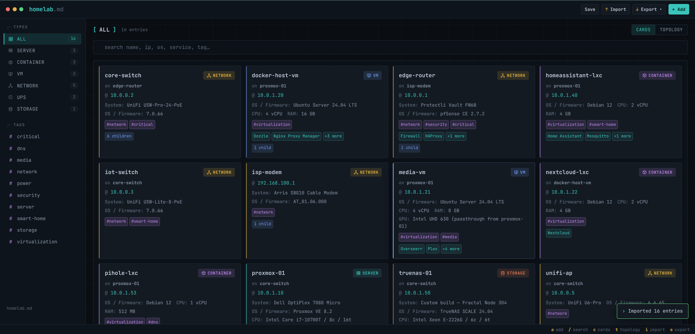

# homelab.md

A single-file, offline-first web app for documenting your homelab infrastructure. Open `index.html` in any browser — no server, no dependencies, no internet required.

## Screenshot

## What It Does

homelab.md gives you a clean interface to catalog every device in your homelab: servers, VMs, LXC containers, network gear, storage, and anything else you're running. It saves everything to a single `homelab.md` Markdown file that you can version with Git, edit in any text editor, or back up however you like.

## Features

- **Full CRUD** — Add, edit, view, and delete entries from the browser UI
- **Parent-child relationships** — Link VMs, containers, and other entries to their host (e.g. LXCs on Proxmox, VMs on TrueNAS). The Host / Parent dropdown is constrained to types that actually make sense (a VM can only sit under a Server, a container under a Server or VM, and so on)
- **Power-source relationships** — Independently track which UPS each entry is plugged into, so you can see your power dependencies separately from the network tree. VMs and containers automatically inherit power from their host in the Power view
- **Free-form tags** — Tag entries with anything that's useful to you (`media`, `prod`, `experimental`, etc.). Tags are lowercased and de-duplicated on save, render as chips on each card, and a chip row appears alongside the type filter so you can click to narrow the view. Tags round-trip through every export format and feed into search
- **Structured services** — Each entry can have multiple services with name, port, notes, a clickable URL, and an optional per-row Private flag
- **Structured storage** — Track multiple drives per entry with type, size, notes, and an optional per-row Private flag
- **Per-type field visibility** — The edit form hides fields that don't apply to the selected type, so a UPS doesn't ask for an OS, a network switch doesn't ask for storage drives, and so on
- **Private flag** — Mark a whole entry, just its Notes block, or individual service/storage rows as Private to keep them out of the public exports
- **Markdown import/save** — The `homelab.md` file is the source of truth. Import to load, **Save** (Ctrl/⌘+S) to write it back. The round-trip is lossless: every field, including timestamps and Notes that contain Markdown like `---` rules, survives a save → import cycle
- **One-click save (Ctrl/⌘+S)** — On supporting browsers, the first save lets you pick where `homelab.md` lives; after that the **Save** button and Ctrl/⌘+S write straight back to that file with no download prompt (the file is remembered across reloads). Browsers without the File System Access API fall back to a normal download
- **CSV export** — Export your full inventory as `homelab.csv` for spreadsheet use, audits, or one-off scripts (includes every entry, Private flag included)
- **JSON import/export** — Export your full inventory as `homelab.json`, a lossless dump of every entry (Private included) for backups or feeding into other tools. The same **↑ Import** button accepts `homelab.json` and restores it exactly
- **Public HTML export** — Export a sanitized, self-contained `homelab.html` that renders an interactive read-only version of the dashboard, ideal for hosting publicly
- **Unsaved-changes indicator** — A small dot appears on the **Save** and **↓ Export** buttons whenever the in-browser data is newer than your last full save, so you don't forget to write changes back to the file
- **Undo on delete** — Deleting an entry shows a toast with an **Undo** button (~6 seconds) that fully restores the entry and any parent / power-source links
- **Safe import** — Importing prompts before replacing existing data and refuses to import a file with no parseable entries, so you can't accidentally wipe your inventory
- **Topology view** — Toggle between Cards and Topology to see a tree-style SVG graph of your homelab. The Topology view has its own **Network / Power** mode switch: Network shows parent → child relationships (solid lines), Power shows UPS → powered-devices relationships (dashed lines, with VMs and containers inherited from their host's power source). Multi-level chains (e.g. Modem → Router → Switch 1 → Switch 2 → Server) render fully. Type filter and search apply to both modes. Available in the main app and the public HTML export
- **Search and filter** — Filter by entry type or search across names, IPs, OS / firmware, system, CPU / RAM / GPU, location, services, storage, and notes
- **Completely offline** — No server, no API calls, no CDN, no external requests of any kind (fonts are bundled into the file). Just one HTML file

## How To Use

1. Download `index.html` and put it in a folder on your machine
2. Open `index.html` in your browser
3. Click **+** to add your first entry
4. Pick a type — the form will hide fields that don't apply (a UPS won't ask for an OS or CPU, a network switch won't ask for storage, etc.)
5. Fill in the details — name, IP, system, OS / firmware, CPU, RAM, GPU, storage, location, services, and notes
6. For VMs, containers, or anything that runs on top of another entry, use the **Host / Parent** dropdown to link it to its host. The dropdown only offers types that make sense for the child type you picked
7. For entries plugged into a UPS, use the **Power Source** dropdown — only UPS entries are eligible. This is independent of the network parent so a single entry can have both (e.g. a Server hosted on a Switch, powered by a UPS). VMs and containers don't get a Power Source of their own — they inherit it from their host
8. Tick **Private** on an entry, row, or the Notes block to keep it out of the public exports
9. Click **Save** (or press **Ctrl/⌘+S**) to write your data to `homelab.md` — or use **↓ Export** for the other formats (`homelab.csv`, `homelab.json`, public `homelab.html`)

### How Data Is Stored

While you're working, your data lives in the browser's `localStorage`. This means your changes persist between page refreshes and browser restarts without needing to do anything. However, `localStorage` is tied to your browser and can be cleared at any time, so it should not be treated as permanent storage.

The `homelab.md` file is the source of truth. Anytime you make changes through the UI, you should save those changes back to the file. A small orange dot appears on the **Save** and **↓ Export** buttons whenever the data in your browser is newer than your last full save — a visual nudge so you don't forget. If you ever need to ensure your current session matches the file (for example, after editing the `.md` file directly in a text editor, or opening the app in a different browser), click **↑ Import** and select your `homelab.md` (or `homelab.json`) file — the format is detected automatically. Importing fully replaces whatever is in `localStorage` with the contents of the file — when existing data is present, you'll be asked to confirm before it's overwritten, and a file with no parseable entries is rejected so a wrong selection can't wipe your inventory.

### Saving

The **Save** button (or **Ctrl/⌘+S**) writes your inventory back to `homelab.md`. On browsers that support the [File System Access API](https://developer.mozilla.org/en-US/docs/Web/API/Window/showSaveFilePicker) (Chromium-based: Chrome, Edge, Brave, etc.), the first save prompts you for where to put the file, and every save after that — including Ctrl/⌘+S — writes straight to that file with **no download prompt**. The chosen file is remembered across page reloads (you'll be asked once per session to re-grant write access, a browser security requirement). Use **Ctrl/⌘+Shift+S** ("Save As") to pick a different file.

On browsers without that API (Firefox, Safari), **Save** falls back to downloading `homelab.md` to your browser's downloads folder the usual way.

### Workflow

The intended workflow is:

1. **Import** your `homelab.md` if you need to sync the UI with the file
2. **Make changes** — add entries, update services, etc.
3. **Save** (Ctrl/⌘+S) to write everything back to `homelab.md`
4. **Commit** the file to Git if you want version history

### The Markdown File

The exported `homelab.md` is human-readable Markdown. Each entry is an `h1` section with metadata as a bullet list, and services/storage as Markdown tables. The Private and Notes-Private flags are serialized as bullet fields so they round-trip cleanly. You can read it, edit it in any text editor, or render it on GitHub. Parent-child and power-source relationships, the entry ID, and the created/updated timestamps are all preserved in the italic footer of each section (`ID`, `ParentID`, `PowerID`, `Created`, `Updated`) and parsed back on import.

Pipe characters (`|`) and newlines inside service or storage notes are escaped on export (`\|`) and unescaped on import, so a note containing `|` won't break the table. The footer is split off before the body is parsed, so a `---` horizontal rule written inside a Notes field is kept intact rather than being mistaken for a section break. The result is a lossless round-trip: export then re-import returns exactly what you had.

### CSV Export

The **↓ Export → homelab.csv** option (under **Full export**) produces a flat `homelab.csv` with one row per entry. Multi-value fields (services, storage) are joined with `;` inside a cell, and the `Private` / `NotesPrivate` flags are included as columns. This is a full export, so Private entries and rows are **not** filtered out — it's intended for spreadsheets, ad-hoc reporting, or feeding the inventory into other tools. It is **not** round-trippable; `homelab.md` (written with **Save**) remains the canonical format.

### JSON Import / Export

The **↓ Export → homelab.json** option (under **Full export**) writes a `homelab.json` file: a complete, lossless dump of every entry exactly as stored, wrapped with a small header (`format`, `version`, `exportedAt`) plus an `entries` array. Like the other full exports it includes **Private** entries and rows, so keep it as private as your `homelab.md`.

The **↑ Import** button accepts `homelab.json` too (alongside `homelab.md`) — it detects the format automatically and restores every entry exactly, IDs, relationships, and timestamps included. Because JSON escapes everything, it's the most faithful backup/restore path; `homelab.md` remains the canonical, human-readable, Git-friendly format.

### Public HTML Export

The **↓ Export → homelab.html** option (under **Public export**) generates a `homelab.html` file: a single, self-contained HTML page that mirrors the look and interactivity of the homelab.md UI but in a read-only form. Drop it on any static host and you get a live, searchable, filterable dashboard of your homelab.

When you choose this export, you'll be prompted for a **Site Name** that replaces "homelab.md" in the top-left of the exported page (e.g. "My Homelab"). The exported file:

- Uses the same theme and layout as the main app
- Supports search, type filters, the Cards / Topology view toggle (Network and Power modes), and the entry detail modal
- Has no add/edit/delete/import/export controls — it's strictly read-only
- Applies **Private filtering and sanitization** before writing (Private entries/rows are omitted; IPs, MAC addresses, URLs, ports, IDs, and timestamps are removed). Sanitization isn't a guarantee — review the exported file before hosting it, especially free-form Notes
- Is fully offline and self-contained — the bundled fonts travel with it, so it makes no external requests either

## Entry Types

- **Server** — Physical machines (Proxmox hosts, Raspberry Pis, mini-PCs, etc.)
- **Virtual Machine** — VMs running on a host
- **Container / LXC** — Containers running on a host or a VM
- **Network Device** — Switches, routers, gateways, access points
- **Storage / NAS** — NAS boxes and dedicated storage appliances
- **UPS / Power** — Battery backups and other power sources; appears in the Power topology view as the root of whatever it powers
- **Other** — KVMs, sensors, or anything that doesn't fit the categories above

## Requirements

A web browser. That's it.

The app uses JetBrains Mono and IBM Plex Sans for typography. Both are **bundled inside `index.html`** — embedded as latin-subset variable-font woff2 files (data URIs), so they render without any network access. The app makes **zero external requests**: no fonts, no CDN, no analytics, nothing leaves your browser. That makes it safe to use on a fully offline or air-gapped machine.

## AI Disclosure

This project was created with the help of AI.
